## Objective

In this script, we apply admixture model on the diarrhea data and try to find whether there is a phenotype of interest that drives the clusters in the mouse samples based on the OTU diversity. We subsequently extract and study the OTUs that are found to drive the clusters. The main phenotype of interest are age groups as age has been found to play an important role in OTU diversity from the other studies. 

## Preparation of Data

We load the diarrhea data from the package msd16s and extract the phenotypes of interest- namely the type (case or control), country, age, age factor and dysentery. We have not used any filtering scheme as of now.

```{r echo=TRUE, eval=TRUE, message=FALSE, warning=FALSE}
rm(list=ls())
setwd('/Users/kushal/Documents/metagenomics/project/')
library(maptpx)
library(CountClust)
library(metagenomeSeq)
library(msd16s)
data(msd16s)
metadata <- pData(msd16s);
counts <- t(MRcounts(msd16s))
samp_metadata <- cbind.data.frame(metadata$Type, metadata$Country, metadata$Age, metadata$AgeFactor, metadata$Dysentery);
colnames(samp_metadata) <- c("type","country","age","age.factor","dysentery");
```

## Admixture model fitting

We now apply admixture model on the diarrhea data and present the Structure plots ordered by the different metadata.

```{r echo=TRUE, eval=TRUE, message=FALSE, warning=FALSE}

if(!dir.exists("../plots/diarrhea-metagenome")) dir.create("../plots/diarrhea-metagenome")

nclus_vec <- 2:7;
if (file.exists("./rdas/diarrhea-metagenome.rda")) {
  diarrhea_metagenome_topics <- get(load("./rdas/diarrhea-metagenome.rda"));  
} else {
StructureObj(counts ,nclus_vec,samp_metadata = samp_metadata, tol=0.0005, batch_lab = NULL, path_rda="./rdas/diarrhea-metagenome.rda",path_struct = "../plots/diarrhea-metagenome");
diarrhea_metagenome_topics <- get(load("./rdas/diarrhea-metagenome.rda"));  
}

for(num in 1:length(nclus_vec))
{
obj <- StructureObj_omega(diarrhea_metagenome_topics[[num]]$omega, samp_metadata = samp_metadata, batch_lab = NULL,partition = rep("TRUE",5),path_struct='../plots/diarrhea-metagenome',control=list(cex.axis=1.5, lwd=2));
}

```

### Structure (by type)

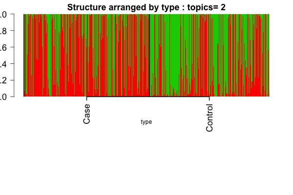


### Structure (by age)


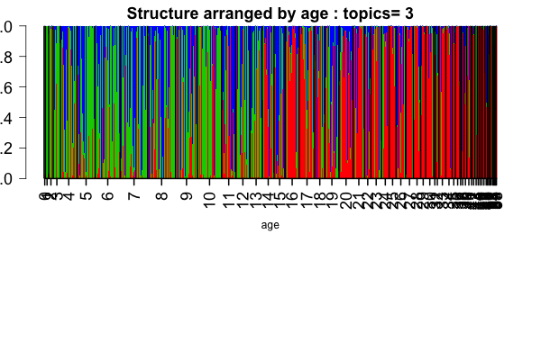
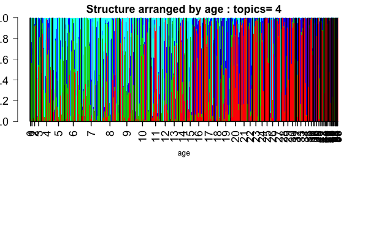
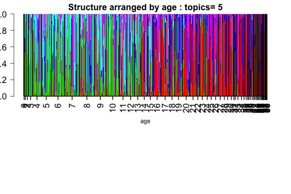

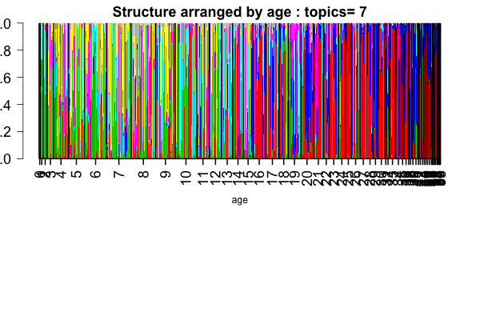

### Structure (by country)

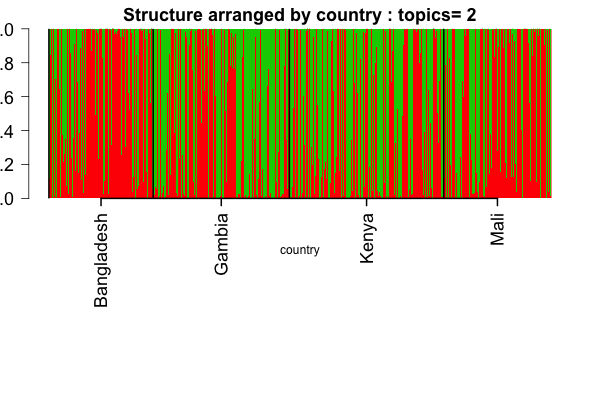
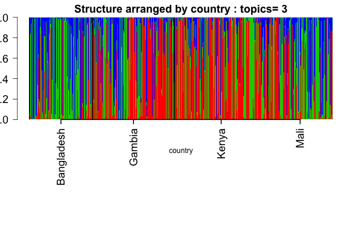
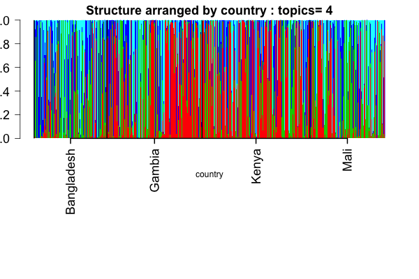
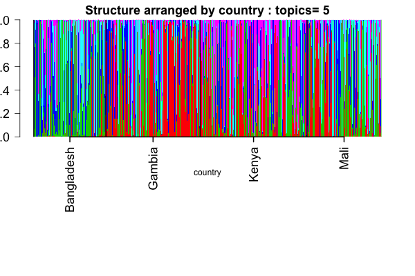

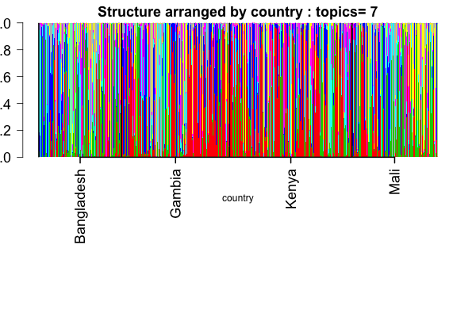

### Structure (by dysentery)


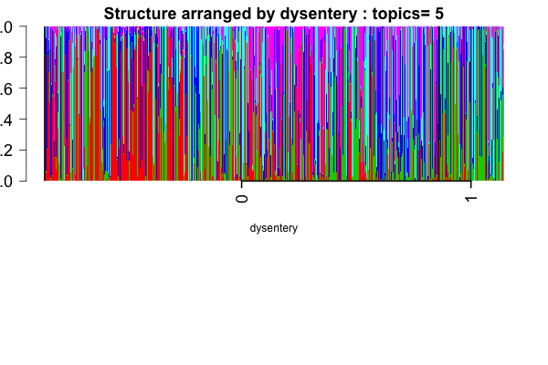

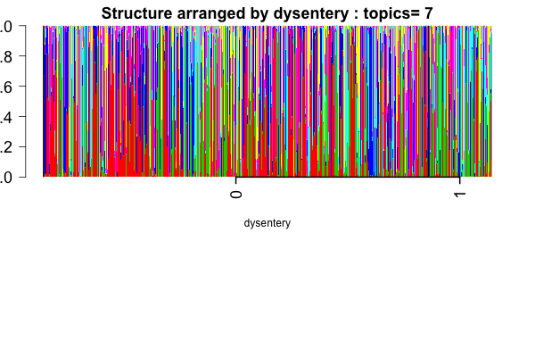

## Observations from Structure

Age seems to be the most imporantant metadata that is driving the clusters. Also from the Structure plots, it seems that the transition between the low age cluster and the high age cluster is occurring in the age range [14-17]. This is interesting because for higher number of clusters as well, it seems these are the two major age groups and the newer clusters are forming within these two age groups and are not so convincing. It does not quite seem that the higher order clusters are reflecting any further age effects. 

## Cluster driving OTUs

We now focus on extracting the significant OTUs that drive the clusters. We do this for $K=2$ with the aim to pick up the OTUs varying across the age.

```{r echo=TRUE, eval=TRUE}
theta <- diarrhea_metagenome_topics[[1]]$theta;
features <- ExtractTopFeatures(theta,top_features=50,method="poisson")

features_vec <- unique(as.vector(features));

class <- as.numeric(apply(theta[features_vec,], 1, which.max))

driving_otus <- rownames(theta[features_vec,]);

driving_otus_per_class <- lapply(1:dim(theta)[2], function(x) driving_otus[which(class==x)]);

names(driving_otus_per_class) <- c("red","green")

save(driving_otus_per_class, file="rdas/driving_otu_diarrhea_clus_2.rda")

```

The output list of the driving genes for each cluster is saved in the **rdas/driving_otu_diarrhea_clus_2.rda** file with the names of the list being the cluster color for the cluster it corresponds to.
