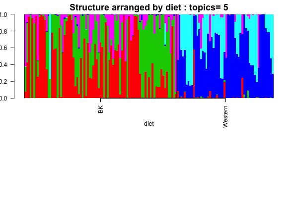
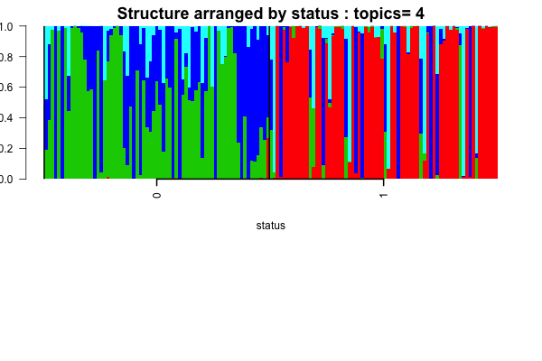
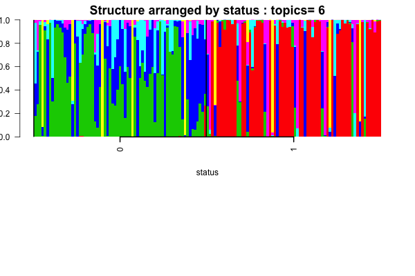
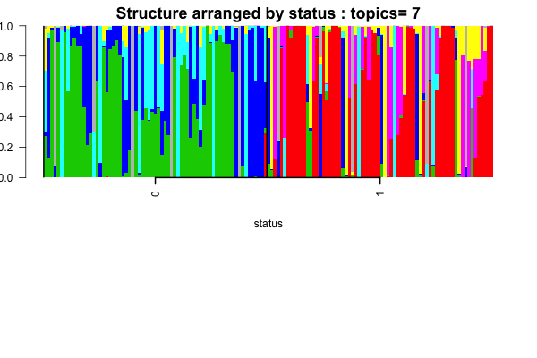
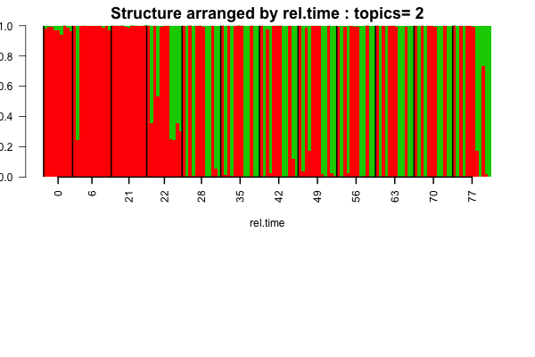
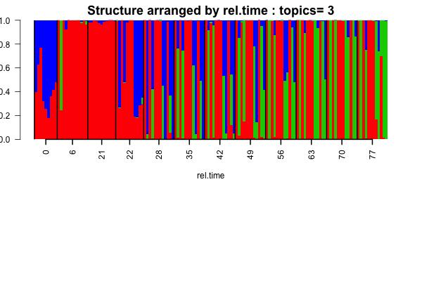
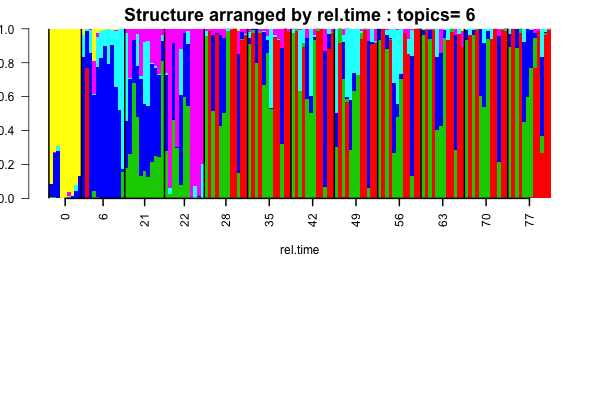

## Objective

In this script, we apply admixture model on the mouse data and try to find whether there is a phenotype of interest that drives the clusters in the mouse samples based on the OTU diversity. We subsequently extract and study the OTUs that are found to drive the clusters.

## Data Preparation
We load the mouse data and extract the phenotypes of interest- namely the diet, status and the relative time. We have not used any filtering scheme as of now.

```{r echo=TRUE, eval=TRUE, message=FALSE, warning=FALSE}
rm(list=ls())
setwd('/Users/kushal/Documents/metagenomics/project/')
library(maptpx)
library(CountClust)
library(metagenomeSeq)
data("mouseData")
metadata <- pData(mouseData);
counts <- t(MRcounts(mouseData))
samp_metadata <- cbind.data.frame(metadata$diet, metadata$relativeTime, metadata$status)
colnames(samp_metadata) <- c("diet","rel.time","status");

```


## Admixture model fitting

Now, we apply the admixture model on the data.

```{r echo=TRUE, eval=TRUE, message=FALSE, warning=FALSE}

if(!dir.exists("../plots/mouse-metagenome")) dir.create("../plots/mouse-metagenome")

nclus_vec <- 2:7;
if (file.exists("./rdas/mouse-metagenome.rda")) {
  mouse_metagenome_topics <- get(load("./rdas/mouse-metagenome.rda"));  
} else {
StructureObj(counts ,nclus_vec,samp_metadata = samp_metadata, tol=0.0005, batch_lab = NULL, path_rda="./rdas/mouse-metagenome.rda",path_struct = "../plots/mouse-metagenome");
mouse_metagenome_topics <- get(load("./rdas/mouse-metagenome.rda"));  
}

for(num in 1:length(nclus_vec))
{
obj <- StructureObj_omega(mouse_metagenome_topics[[num]]$omega, samp_metadata = samp_metadata, batch_lab = NULL,partition = rep("TRUE",dim(samp_metadata)[2]),path_struct='../plots/mouse-metagenome',control=list(cex.axis=1));
}

```

### Structure (by diet)





### Structure (by status)







### Structure (by rel.time)








## Observations from Structure

It seems that for $K=2$, the admixture method is picking up two very distinct clusters which seems from The Structure plots to be difference in diet- BK and Western. However, it is not convincing because there also seems to be a bit of a confounding effect between status and diet. However, diet seems to be the stronger candidate. Post $K=2$, for higher number of clusters, we find that the clusters are reflecting the time variation. So, if we annotate the OTUs driving the higher order clusters, we should get OTUs that are differentially abundant over time. The other interesting observation was that there seemed to be some difference between times $21$ and $22$ despite these times being very close. I also wonder why two back to back time points would be reported and they would be so different. Is there a biological explanantion for this. Can this be technical error?

## Cluster driving OTUs

We now focus on extracting the significant OTUs that drive the clusters. We do this for $K=2$ with the aim to pick up the OTUs varying across the diet and also for $K=7$ with the aim to pick up the OTUs varying across time in abundance patterns.

### K=2 case study

```{r echo=TRUE, eval=TRUE}
theta <- mouse_metagenome_topics[[1]]$theta;
features <- ExtractTopFeatures(theta,top_features=50,method="poisson")

features_vec <- unique(as.vector(features));

class <- as.numeric(apply(theta[features_vec,], 1, which.max))

driving_otus <- rownames(theta[features_vec,]);

driving_otus_per_class <- lapply(1:dim(theta)[2], function(x) driving_otus[which(class==x)]);

names(driving_otus_per_class) <- c("red","green")

save(driving_otus_per_class, file="rdas/driving_otu_clus_2.rda")

```

The output list of the driving genes for each cluster is saved in the **rdas/driving_otu_clus_2.rda** file with the names of the list being the cluster color for the cluster it corresponds to. 

### K=7 case study

We now obtain the OTU names for $K=7$ that drive the clusters. 

```{r echo=TRUE, eval=TRUE}
theta <- mouse_metagenome_topics[[6]]$theta;
features <- ExtractTopFeatures(theta,top_features=50,method="poisson")

features_vec <- unique(as.vector(features));

class <- as.numeric(apply(theta[features_vec,], 1, which.max))

driving_otus <- rownames(theta[features_vec,]);

driving_otus_per_class <- lapply(1:dim(theta)[2], function(x) driving_otus[which(class==x)]);

names(driving_otus_per_class) <- c("red","green","blue","cyan","pink","yellow","gray");

save(driving_otus_per_class, file="rdas/driving_otu_clus_7.rda")

```

The output list of the driving genes for each cluster is saved in the **rdas/driving_otu_clus_7.rda** file with the names of the list being the cluster color for the cluster it corresponds to. 


